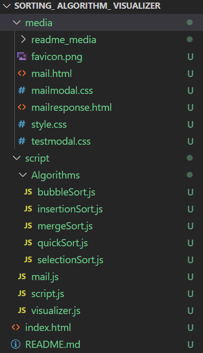
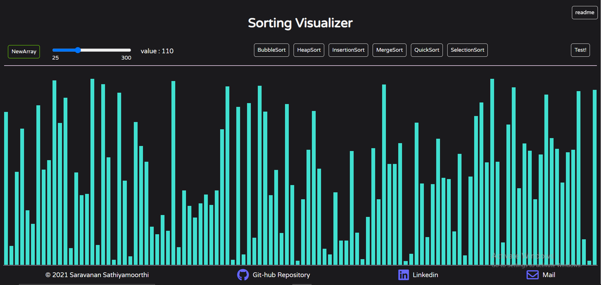
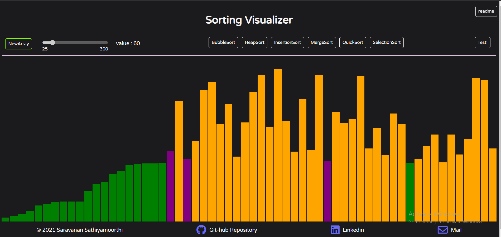
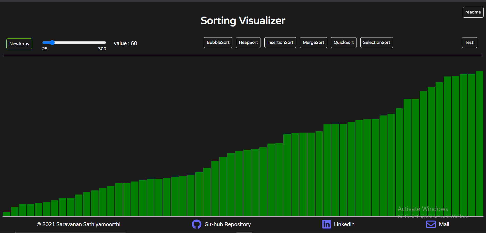

# Sorting Visualizer

---

### About :

This is a project that visualizes some of the Sorting Algorithms.
[Go to the visualizer](./index.html)

---

#### List of Algorithms :

The following are the sorting algorithms that are visualized.

- Bubble Sort
- Heap Sort
- Insertion Sort
- Merge Sort
- Quick Sort
- Selection Sort

---

### Languages Used:

1. HTML
2. CSS
3. JavaScript

---

### Code Layout and Animations:

The following is the structure of the code -

The UI design of Webpage :

While Sorting :

After Sorting is done :

---

<footer>
Author : Saravanan Sathiyamoorthi
